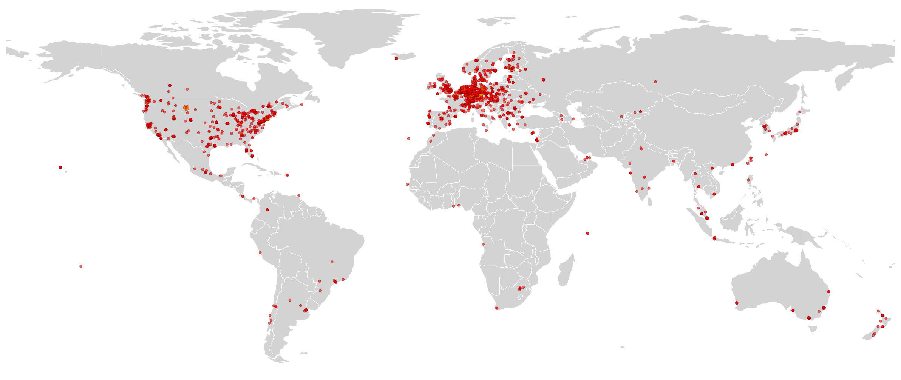
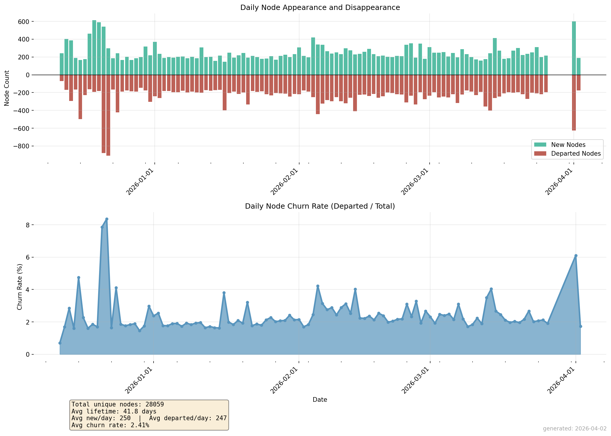
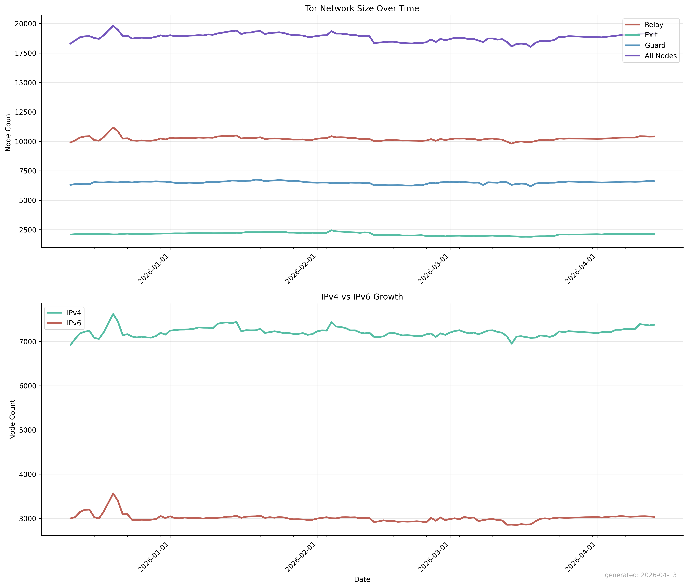
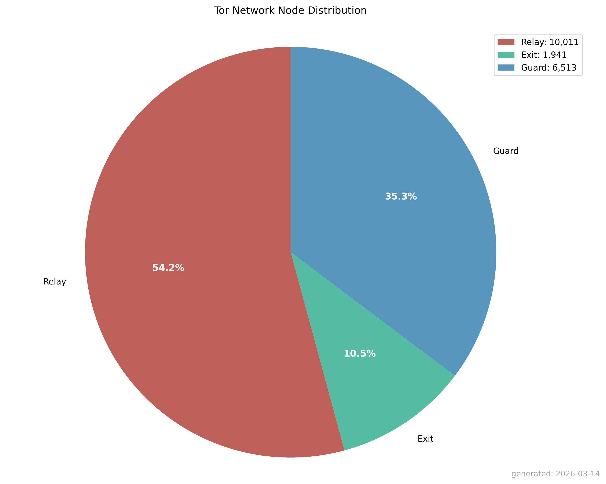

# Tor Network Node Tracker

[](https://github.com/doodad-labs/tor-node-tracker/blob/main/active/relay-nodes.txt)
[](https://github.com/doodad-labs/tor-node-tracker/blob/main/active/guard-nodes.txt)
[](https://github.com/doodad-labs/tor-node-tracker/blob/main/active/exit-nodes.txt)

An automated hourly archive of active Tor network nodes with comprehensive historical tracking. This repository provides structured datasets of relay, exit, and guard nodes for research, monitoring, and analysis purposes.

This system continuously monitors and archives Tor network infrastructure by collecting data directly from the Tor network every hour. The data is categorized into three distinct node types and preserved with complete historical records for longitudinal analysis.

## Node Categories

- **Relay Nodes**: All active relays operating within the Tor network, forming the core infrastructure for traffic routing.
- **Exit Nodes**: Specialized relays configured to allow traffic to exit the Tor network and reach the public internet.
- **Guard Nodes**: Entry points to the Tor network, selected as the first hop in circuit creation due to their stability and performance.

## Repository Structure

```
├── active/                     # Current node lists (hourly updates)
│   ├── relay-nodes.json        # All active relays (JSON)
│   ├── relay-nodes.txt         # All active relays (Plain text)
│   ├── relay-nodes.csv         # All active relays (Comma-separated values)
│   ├── exit-nodes.json         # Exit-capable relays (JSON)
│   ├── exit-nodes.txt          # Exit-capable relays (Plain text)
│   ├── exit-nodes.csv          # Exit-capable relays (Comma-separated values)
│   ├── guard-nodes.json        # Guard-capable relays (JSON)
│   ├── guard-nodes.txt         # Guard-capable relays (Plain text)
│   └── guard-nodes.csv         # Guard-capable relays (Comma-separated values)
│
└── history/                    # Historical archives
     └── YYYY/
         └── MM/
             └── YYYY-MM-DD/            # Daily snapshots
                 ├── relay-nodes.json   # All active relays (JSON)
                 ├── relay-nodes.txt    # All active relays (Plain text)
                 ├── relay-nodes.csv    # All active relays (Comma-separated values)
                 ├── exit-nodes.json    # Exit-capable relays (JSON)
                 ├── exit-nodes.txt     # Exit-capable relays (Plain text)
                 ├── exit-nodes.csv     # Exit-capable relays (Comma-separated values)
                 ├── guard-nodes.json   # Guard-capable relays (JSON)
                 ├── guard-nodes.txt    # Guard-capable relays (Plain text)
                 └── guard-nodes.csv    # Guard-capable relays (Comma-separated values)
```

## Data Specifications

- **Update Frequency:** Hourly synchronization  
- **Data Source:** Direct Tor network queries  
- **Formats Available:**
  - **JSON** – Structured data for programmatic access and analysis
  - **Plain Text** – Human-readable format for quick reference and simple parsing
  - **Comma-separated values** – Analytical format for quick parsing
- **Retention:** Complete historical records with daily organization

## Analytical Charts



These charts are generated daily. The latest up-to-date versions can be found in [`stats/`](./stats/), where they are refreshed each day. Historical charts are available in their respective [`history/`](./history/) directories.

<details>
     <summary>Node Churn Rate & Lifetime</summary>


     
</details>

<details>
     <summary>Network growth over time</summary>


     
</details>

<details>
     <summary>Active node distribution</summary>


     
</details>

## Ethical Consideration

**Bridge nodes will never be tracked or published.** We recognize that publishing bridge node information would directly harm users in censored regions who rely on these resources for safe access to the Tor network. This repository is intentionally limited to publicly discoverable relay infrastructure only.

## Usage

The data is suitable for:
- Network research and analysis
- Security monitoring and threat intelligence
- Academic studies of decentralized networks
- Infrastructure monitoring and visualization projects

## Automation

All data collection, processing, and archiving is fully automated through scheduled workflows, ensuring consistent updates without manual intervention.

## Changelogs
- [`1da73f7`](https://github.com/doodad-labs/tor-node-tracker/commit/1da73f76f0cc2f5530777457053b53f960349c21) Introduction of Churn Rate and Lifetime Chart
- [`d6218c6`](https://github.com/doodad-labs/tor-node-tracker/commit/d6218c63fe833ac96a9d79960b32935c18877841) Introduction of Active Node Location Chart
- [`6e7face`](https://github.com/doodad-labs/tor-node-tracker/commit/6e7faceb24bfe1fa728d69ba00edbc86f77fa301) Introduction of Active Node Location Data
- [`c0d14be`](https://github.com/doodad-labs/tor-node-tracker/commit/c0d14bee3cea6257ce00b9f876a62175dcc0b4c7) Introduction of Network Growth and Node Distribution Analytical charts
- [`73d0770`](https://github.com/doodad-labs/tor-node-tracker/commit/73d07708ed020fb6c8f6b7b3d59b56f8a0989a48) Introduction of CSV data format 

## Outage History

Sometimes monitoring systems go offline or break this is a log of all them instances.

- `02/02/2026 @ 6:21 PM - 02/02/2026 @ 11:09 PM` [github actions outages](https://www.githubstatus.com/incidents/xwn6hjps36ty) 
